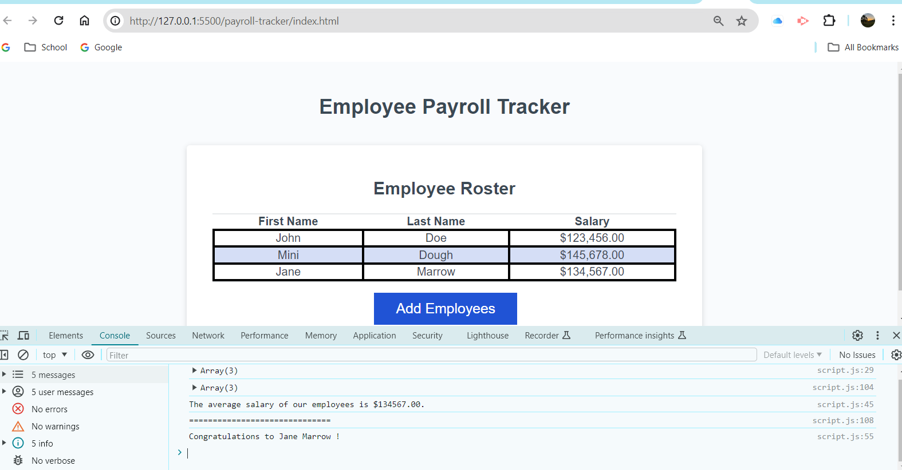

# Payroll-tracker

## Project Description

Modify starter code to create an application that enables a payroll manager to view and manage employee payroll data. The app is to feature dynamically updated HTML and CSS powered by JavaScript code, and have a clean and polished, responsive user interface that adapts to multiple screen sizes.

### Detail of Work

    * Made an employee payroll tracker
    * Added employee" button with a series of prompts asking for first name, last name, and salary
    * Prompt to continue to add another employee or cancel and display listed employees in alphabetical order
    * Employee data is displayed on the page sorted alphabetically by last name, and the console shows computed and 
      aggregated data     
    * Checked for functionality issues and broken links
    * Commented on changed code 

[Employee Payroll Tracker](https://smrsun.github.io/payroll-tracker/)

[Link to Github Repo Page](https://github.com/smrsun/payroll-tracker)
